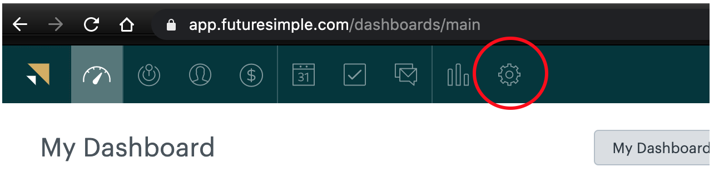
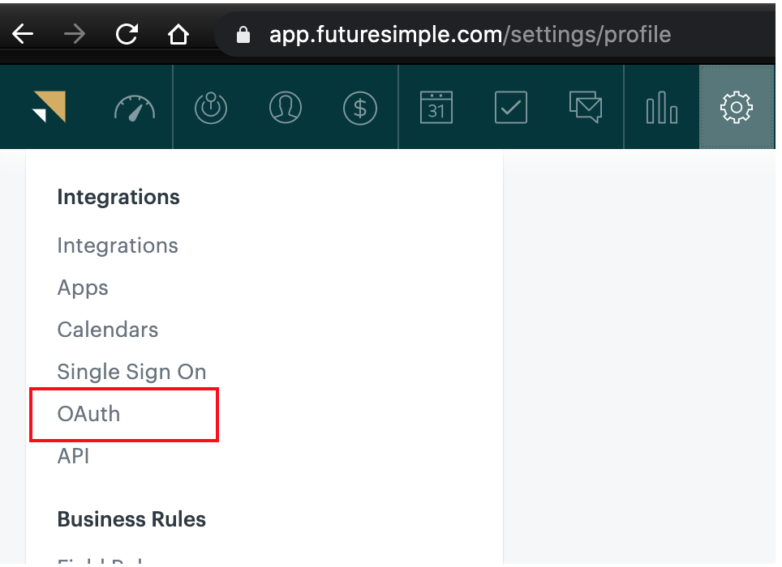
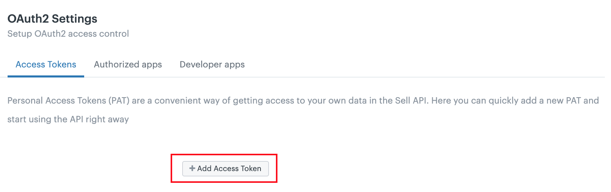
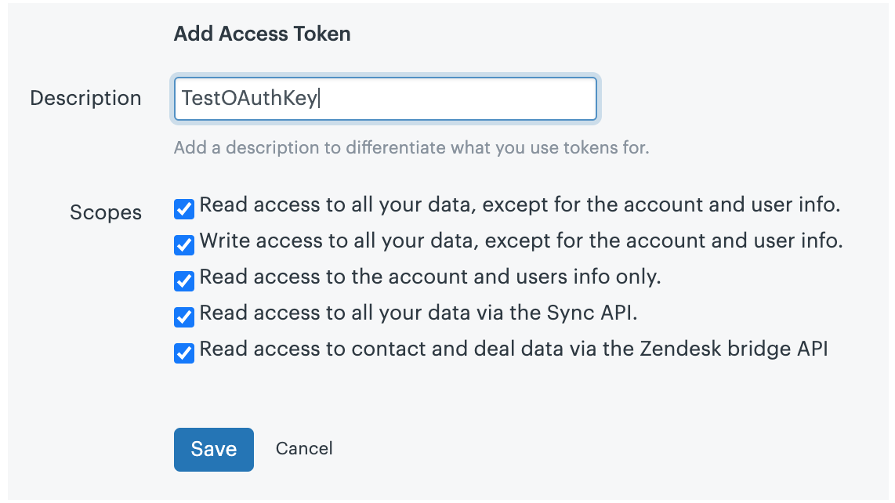
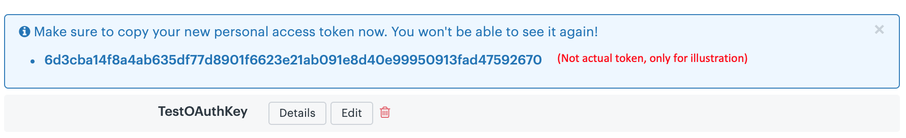
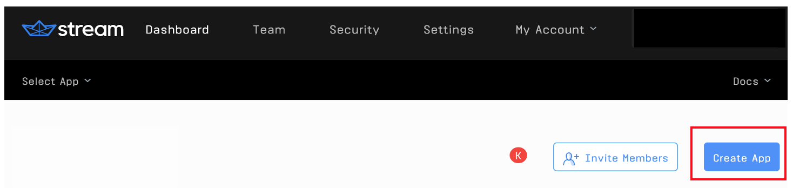
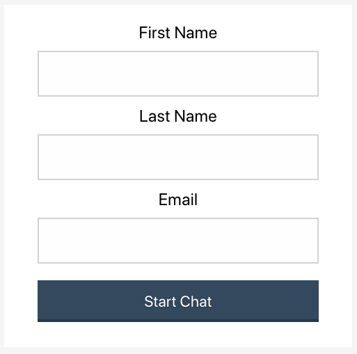
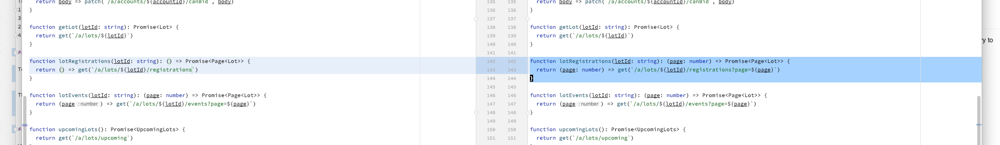

# Generate Zendesk Leads from Landing Page Chat using React Hooks
This post will demonstrate how to configure a Lead creation in Zendesk from a customer inquiry via a landing page/sales chat widget. We'll build a full-screen experience that can be embedded on your homepage or landing pages. Our chat experience will start with a simple user registration to capture first name, last name, and email before moving them into a one-on-one private chat with a sales representative. Please note, the sales representative experience is out of scope for this post.

## Application Process Flow
* The user initiates an inquiry chat
* User provides basic information via a form
* The frontend passes the information to the backend, which sends a request to Zendesk to create the Lead and gets a secure frontend token from Stream
* The frontend displays the chat screen.

## Overview
The application described in this post is composed of a React `frontend` and an Express `backend`. The backend also leverages Stream's [JavaScript library](https://github.com/GetStream/stream-js) to generate a frontend token, and Axios to send data to Zendesk via the Zendesk Sell API. All the code required for this tutorial is available in [github](https://github.com/psylinse/stream-crm-lead-chat/).

First, we need to register and configure our accounts:
1. [Registering and Configuring Zendesk](#registering-and-configuring-zendesk)
1. [Registering and Configuring Stream](#registering-and-configuring-stream)

Once we have our accounts we'll walk through the code step by step:
1. [Step 1: User Enters Details](#step-1-user-enters-details)
1. [Step 2: Backend Creates CRM Lead and Authenticates User to Chat](#step-2-backend-creates-crm-lead-and-authenticates-user-to-chat)
1. [Step 3: Frontend Registers and Configures Chat](#step-3-frontend-registers-and-configures-chat)
1. [Step 4: User Enters Chat Room](#step-4-user-enters-chat-room)

## Prerequisites

To follow along with the post, you will need a free [Stream](https://getstream.io/get_started/?signup=#flat_feed) account and a Zendesk Sell account. For this post, we used a Trial version of [Zendesk Sell](https://www.zendesk.com/register/?source=zendesk_sell#step-1).

This post requires basic knowledge of [React Hooks](https://reactjs.org/docs/hooks-intro.html), [Express](https://expressjs.com/), [Node.js](https://nodejs.org/en/ "node website"), and [Axios](https://github.com/axios/axios "Axios documentation on Github"). The code is intended to run locally. A basic understanding of [Zendesk Sell API](https://developer.zendesk.com/rest_api/docs/sell-api/apis) is also needed to configure the secure communication between the app and Zendesk (the specific steps needed are provided in the post).

There are three references that you need to provide in a .env file to make this application function:
* STREAM_API_KEY
* STREAM_API_SECRET
* ZENDESK_CRM_TOKEN

 We're using [dotenv](https://github.com/motdotla/dotenv) to configure our environment. A template file named `.env.example` is provided. Just update the values shown with your unique keys, secrets, and tokens, then remove the `.example` from the file name. We'll go over how to acquire these values next.

To integrate with Zendesk Sell we need to first configure the OAuth security settings from your Zendesk Sell Settings Panel using the following steps. Please note: if your dashboard looks different from the images shown below, you might be in the Zendesk Dashboard, not the Zendesk Sell Dashboard. They are separate products so make sure you're in the right place!

### Registering and Configuring Zendesk

1. First, go to Settings



2. Click on "OAuth" under the "Integrations" menu item



3. Click on the button labeled, "+ Add Access Token"



4. Complete description and leave settings unchanged (more restrictive settings may be required for your application) and click "Save"



5. Copy the access token, which you will need to configure your backend communication with Zendesk.



You will update the backend with this Zendesk OAuth Token as explained in the next section.

### Registering and Configuring Stream

To get the Stream API Key and API Secret, navigate to your [Stream.io Dashboard](https://getstream.io/dashboard/). 


Once you're there, click on "Create App", and complete the form like in the following screenshot.



Give your app a name, select "Development" and click "Submit". 
 


Stream will generate a Key and Secret for your app. You need to copy these into your `.env` file. 
 


When the `.env` file has been created, you can start the backend by `npm start` command from the backend folder.

## Step 1: User Enters Details

First, we'll create the sales lead generation form the user sees when first landing on your site. This is a simple React form that shows if they haven't started a chat yet. Here's what our form looks like.



This snippet shows how the form is created (the chat app code is ignored for now, as indicated with `// ...`). 
 
<!-- https://gist.github.com/psylinse/d9a2388c31e224e3f003061dd9de373d -->
```jsx
// frontend/src/App.js:7
function App() {
    const [firstName, setFirstName] = useState('');
    const [lastName, setLastName] = useState('');
    const [email, setEmail] = useState('');

    // We'll get to these in a bit
    const [chatClient, setChatClient] = useState(null); 
    const [channel, setChannel] = useState(null);

    async function register() {
        // ...
    }


    if (chatClient && channel) {
       // ...
    } else {
        return (
            <div className="app">
                <div className="app-input">
                    <label htmlFor="firstName">First Name</label>
                    <input type="text" name="firstName"
                        value={firstName}
                        onChange={(e) => setFirstName(e.target.value)}
                    />
                </div>
                <div className="app-input">
                    <label htmlFor="lastName">Last Name</label>
                    <input type="text" name="lastName"
                        value={lastName}
                        onChange={(e) => setLastName(e.target.value)}
                    />
                </div>
                <div className="app-input">
                    <label htmlFor="email">Email</label>
                    <input type="text" name="email"
                        value={email}
                        onChange={(e) => setEmail(e.target.value)}
                    />
                </div>
                <button onClick={() => register()}>Start Chat</button>
            </div>
        );
    }
}
```

Here we have a simple React form that binds three values, first name, last name, and email. We use React Hook's `useState` to store these values. When a user clicks on "Start Chat" we call our `register` function. We'll see this function in Step 3.

## Step 2: Backend Creates CRM Lead and Authenticates User to Chat

Before we look at our frontend `register` function, let's build the backend that supports it. 

** Note: For this post, we will send the minimum level of information to create a CRM Lead, your requirements may differ, and can easily be added using the Zendesk API documentation. **

In the next code snippet, we use express to create a single endpoint, `/registrations`, that performs the following steps: 
1. Generate our Lead in Zendesk Sell CRM
2. Register the user in Stream
3. Generate a Stream chat [channel](https://getstream.io/chat/docs/initialize_channel/?language=js)
4. Generate a Stream [frontend token](https://getstream.io/blog/integrating-with-stream-backend-frontend-options/). 

<!-- https://gist.github.com/psylinse/8d4b354d0d9e8efe361b7f98bcc723a1 -->
```javascript
// backend/routes/index.js:6
router.post('/registrations', async (req, res, next) => {
    try {
        await axios.post(
            'https://api.getbase.com/v2/leads',
            {
                data: {
                    'first_name': `${req.body.firstName}`,
                    'last_name': `${req.body.lastName}`,
                    'description': 'Lead created through Chat Inquiry',
                    'email': `${req.body.email}`
                }
            },
            {
                headers: {
                    'Accept': 'application/json',
                    'Content-Type': 'application/json',
                    'Authorization': `Bearer ${process.env.ZENDESK_CRM_TOKEN}`
                }
            }
        );
        const client = new streamChat.StreamChat(
            process.env.STREAM_API_KEY,
            process.env.STREAM_API_SECRET
        );
        const user = {
            id: `${req.body.firstName}-${req.body.lastName}`.toLowerCase(),
            role: 'user',
            image: `https://robohash.org/${req.body.email}`
        };
        await client.upsertUsers([user, { id: 'sales-admin', role: 'admin' }]);
        const channel = client.channel('messaging', user.id, {
            members: [user.id, 'sales-admin'],
        });
        const token = client.createToken(user.id);
        res.status(200).json({
            userId: user.id,
            token,
            channelId: channel.id,
            apiKey: process.env.STREAM_API_KEY
        });
    } catch (error) {
        console.log(error, data.errors);
        res.status(500).json({
            error: error.message
        });
    }
});
```

First, we use `axios` to do an HTTP Post to the Zendesk Sell API (`api.getbase.com`). We pass along the first name, last name, and email. We grab our Zendesk OAuth token from the environment. That's all we need to do to get our lead created.

Once our App is registered as a StreamChat Client, we'll create a specific Chat Channel which our Customer and Support Agent will connect to. Stream allows for public chats, but to make our Channel private, we'll specify 'members' of that channel using unique id's, and register them with our Client Instance. 

To generate the customer's id, we'll modify the Customer's frontend input (Stream ids must be lowercase with no whitespace), and create a 'user' object to identify them. You can specify unique roles with different capabilities; our Customer will be granted a generic 'user' role, with limited abilities. We'll throw on the optional 'image' key to give the Customer a random avatar.

Normally, you could create another object for the Support Agent on the other end of the chat, but for this case, we will lazily register a Support Agent inline.

The `upsertUsers` method registers (or updates) users. Our Customer ('user') and our Support Agent ('sales-admin') are registered so they can join the chat channel.

Next, we create the Chat Instance with the `channel` method, passing a chat type (`messaging` [type](https://getstream.io/chat/docs/channel_features/?language=js)'), a channel id (in this case `user.id`), and the members allowed to join. Then we use `StreamChat` client's 'createToken()' method to create a token for our Customer. All that's left is to respond to our frontend with the required information to join.

## Step 3: Frontend Registers and Configures Chat

Now that we have our `/registrations` endpoint, let's go back to our frontend and look at our `register` function. 
 
<!-- https://gist.github.com/psylinse/eba16cba7fb6dfd1fb9154558615068c -->
```jsx
// frontend/src/App.js:15
async function register() {
    const response = await fetch("http://localhost:8080/registrations", {
        method: "POST",
        headers: {
            'Accept': 'application/json',
            'Content-Type': 'application/json'
        },
        body: JSON.stringify({
            firstName,
            lastName,
            email
        })
    })
    const { userId, token, channelId, apiKey } = await response.json();
    const chatClient = new StreamChat(apiKey);
    await chatClient.setUser(
        {
            id: userId,
            name: email,
            image: `https://getstream.io/random_svg/?id=${userId}`
        },
        token,
    );


    const channel = chatClient.channel('messaging', channelId);
    setChatClient(chatClient);
    setChannel(channel)
}
```

Our `register` function first performs an HTTP Post to our backend with the fields bound in the form. The backend responds with `userId`, `token`, `channelId`, and `apiKey` which are what we need to configure the chat client and user in the frontend. To load StreamChat to our React frontend we initialize a `StreamChat` instance, then set our Customer User via `setUser`. This call authenticates the client to communicate with the Stream Chat API on behalf of that user. We then retrieve the appropriate channel via `chatClient.channel` and set our component's state.

## Step 4: User Enters Chat Room

Now that we have our chat client and channel, we can enter the chat room. Let's look at the other half of our render's `if` statement.

<!-- https://gist.github.com/psylinse/e4bd8263eeb838fca616ecb8f0d3ed2d -->
```jsx
// frontend/src/App.js:45
if (chatClient && channel) {
    return (
        <div className="App">
            <Chat client={chatClient} theme={'messaging light'}>
                <Channel channel={channel}>
                    <Window>
                        <ChannelHeader />
                        <MessageList />
                        <MessageInput />
                    </Window>
                    <Thread />
                </Channel>
            </Chat>
        </div>
    )
} else {
  // ...
}
```

Since Stream Chat's [React library](https://getstream.io/react-activity-feed/) provides us out of the box components, we simply configure their `Chat` and `Channel` components and embed the parts of the chat we want to see. This renders a great out of the box chat experience. Ready to add the polish? Check out [Stream's free, gorgeous UI Kit](https://getstream.io/chat/ui-kit/).



And that does it! You now understand how to integrate Stream Chat with Zendesk Sell to create Leads during your sales chat experience. Similar integrations can be configured with other Zendesk Objects like Contacts, Deals, Calendar, and Tasks.
