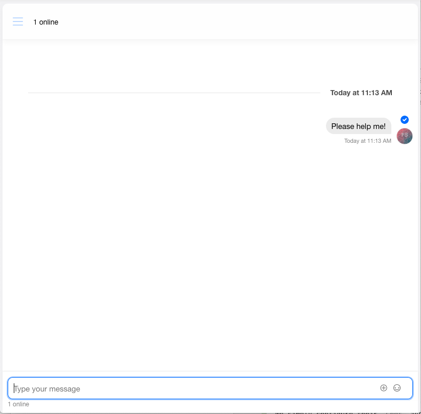

# Generate Zendesk Leads From Landing Page Chat using React Hooks
This post will demonstrate how to configure a Lead creation in Zendesk from a customer inquiry via a Chat bot interaction. We'll build a full screen experience that can be embedded on your homepage or landing pages. Our chat experience will start with a simple user registration to capture first name, last name, and email before moving them into a one-on-one private chat with a sales representative. Please note, the sales representative experience is out of scope for this post.

## Process Flow of the Application
* The user initiates an inquiry chat
* User provides basic information via a form
* The frontend passes the information to the backend, which sends a request to Zendesk to create the Lead and gets a secure frontend token from Stream
* The frontend displays the chat screen.

## Overview
The application described in this post is composed of a React `frontend` and an Express `backend`. The backend also leverages Stream's [JavaScript library](https://github.com/GetStream/stream-js) to generate a frontend token, and Axios to send data to Zendesk via the Zendesk Sell API. All the code required for this tutorial is available in [github](https://github.com/psylinse/stream-crm-lead-chat/).

The steps we will take to configure this application are:
1. [Create an Access Token in Zendesk](#create-an-access-token-in-zendesk)
3. [Configure the security token keys in the backend and start the backend](#configure-the-security-token-keys-in-the-backend-and-start-the-backend)
2. [Create a Stream Chat Session](#create-a-stream-chat-session)
4. [Setup the frontend form and chat bot](#setup-the-frontend-form-and-chat-bot)

## Prerequisites

To follow along with the post, you will need a free [Stream](https://getstream.io/get_started/?signup=#flat_feed) account, and a Zendesk Sell account. For this post, we used a Trial version of [Zendesk Sell](https://www.zendesk.com/register/?source=zendesk_sell#step-1).

This post requires basic knowledge of [React Hooks](https://reactjs.org/docs/hooks-intro.html), [Express](https://expressjs.com/), [Node.js](https://nodejs.org/en/ "node website"), and [Axios](https://github.com/axios/axios "Axois documentation on Github"). The code is intended to run locally. A basic understanding of [Zendesk Sell API](https://developer.zendesk.com/rest_api/docs/sell-api/apis) is also needed to configure the secure communication between the app and Zendesk (the specific steps needed are provided in the post).

### Registering and Configuring Zendesk

While Stream is capable of integrating into all of Zendesk's API, the purpose of this post is not to explain Zendesk configuration in detail. The code snippets shown will allow you to create and update Leads in your Zendesk system. In order to integrate with Zendesk Sell we need to configure the OAuth security settings from your Zendesk Sell Settings panel with the following steps: 

1. First go to Settings


2. Click on "OAuth" under the "Integrations" menu item


3. Click on the button labeled, "+ Add Access Token"


4. Complete description and leave settings unchanged (more restrictive settings may be required for your application) and click "Save"


5. Copy value of the access token, which you will need to configure your backend communication with zendesk.


You will update the backend with this Zendesk OAuth Token as explained in the next section.

### Registering and Configuring Stream

The React.js is already configured to present the user form and to interact with the backend. No code modifications is required. The frontend application code is composed in the [App.js](frontend/App.js).

There are three references that you need to provide in a .env file to make the application function:
- STREAM_API_KEY
- STREAM_API_SECRET
- ZENDESK_CRM_TOKEN

You can create an .env file from the .env.example and provide the credentials and/or tokens that are required.

In order to get these credentials, navigate to your [Stream.io Dashboard](https://getstream.io/dashboard/). 


Once you're there, click on "Create App", and complete the form like in the following screenshot.


Give your app a name and select "Development" and click `Submit`.


Once you have created a Stream app, Stream will generate a Key and Secret for your app. You need to copy these copy the Key and Secret and update the backend file, "FILENAME/LOCATION"


When the .env file has been created, you can start the backend by `npm start` command from the backend folder.

## Step 1: User Enters Details

First, we'll create the sales lead generation form the user sees when first landing on your site. This is a simple react form that shows if they haven't started a chat yet. Here's what our form looks like.


Here's our frontend code. For now, code related to the actual chat is ignored (indicated by `//...`).

```jsx
// frontend/src/App.js:7
function App() {
    const [firstName, setFirstName] = useState('');
    const [lastName, setLastName] = useState('');
    const [email, setEmail] = useState('');

    // We'll get to these in a bit
    const [chatClient, setChatClient] = useState(null); 
    const [channel, setChannel] = useState(null);

    async function register() {
        // ...
    }


    if (chatClient && channel) {
       // ...
    } else {
        return (
            <div className="app">
                <div className="app-input">
                    <label htmlFor="firstName">First Name</label>
                    <input type="text" name="firstName"
                        value={firstName}
                        onChange={(e) => setFirstName(e.target.value)}
                    />
                </div>
                <div className="app-input">
                    <label htmlFor="lastName">Last Name</label>
                    <input type="text" name="lastName"
                        value={lastName}
                        onChange={(e) => setLastName(e.target.value)}
                    />
                </div>
                <div className="app-input">
                    <label htmlFor="email">Email</label>
                    <input type="text" name="email"
                        value={email}
                        onChange={(e) => setEmail(e.target.value)}
                    />
                </div>
                <button onClick={() => register()}>Start Chat</button>
            </div>
        );
    }
}
```

Here we have a simple React form that binds three values, first name, last name, and email. We use React Hook's `useState` to store these values. When a user clicks on "Start Chat" we call our `register` function. We'll see this function in Step 3.

## Step 2: Backend Creates CRM Lead and Authenticates User to Chat

Before we look at our `register` function, lets build the backend that supports it. 

** Note: For the purposes of this post, we will send the minimum level of information in order to create a CRM Lead, your requirements may differ, and can easily be added using the Zendesk API documentation. **

Using express we'll create a single endpoint, `/registrations`, that registers our lead in Zendesk Sell CRM. Once it's done this, it'll register the user in Stream, generate a chat [channel](https://getstream.io/chat/docs/initialize_channel/?language=js), and generate a Stream [frontend token](https://getstream.io/blog/integrating-with-stream-backend-frontend-options/). 


```javascript
// backend/routes/index.js
router.post('/registrations', async (req, res, next) => {
    try {
        await axios.post(
            'https://api.getbase.com/v2/leads',
            {
                data: {
                    'first_name': `${req.body.firstName}`,
                    'last_name': `${req.body.lastName}`,
                    'description': 'Lead created through Chat Inquiry',
                    'email': `${req.body.email}`
                }
            },
            {
                headers: {
                    'Accept': 'application/json',
                    'Content-Type': 'application/json',
                    'Authorization': `Bearer ${process.env.ZENDESK_CRM_TOKEN}`
                }
            }
        );
        const client = new streamChat.StreamChat(
            process.env.STREAM_API_KEY,
            process.env.STREAM_API_SECRET
        );
        const user = {
            id: `${req.body.firstName}-${req.body.lastName}`.toLowerCase(),
            role: 'user',
            image: `https://robohash.org/${req.body.email}`
        };
        await client.upsertUsers([user, { id: 'sales-admin', role: 'admin' }]);
        const channel = client.channel('messaging', user.id, {
            members: [user.id, 'sales-admin'],
        });
        const token = client.createToken(user.id);
        res.status(200).json({
            userId: user.id,
            token,
            channelId: channel.id,
            apiKey: process.env.STREAM_API_KEY
        });
    } catch (error) {
        console.log(error, data.errors);
        res.status(500).json({
            error: error.message
        });
    }
});
```

First, we use `axios` to do an HTTP Post to the Zendesk Sell API (`api.getbase.com`). We pass along the first name, last name and email. We're using [dotenv](https://github.com/motdotla/dotenv) to configure our OAuth token in order to authenticate with Zendesk's API (as discussed in the configuration sections above).  That's all we need to do to get our lead created.

Next, we create a `StreamChat` object which is our client to communicate with the Stream Chat API. We create a Stream user object with an appropriate id (Stream id's must be lowercase with no whitespace), that represents oru customer. We upsert the customer, alongside a sales admin user into Stream. Since Stream's `upsertUsers` method will create or update the users, our `sales-admin` is generated lazily the first time we a user interacts with our backend. Normally, you'd likely generate this user once and configure the id for user here. To keep things simple, we're simply doing everything in line. As mentioned previously, we're not diving into the Sales person's chat experience in this post.

After the Stream library creates the users, we can create our one-on-one channel between the customer and the sales user. We call to `client.create` with `messaging` and the `members` that are allowed. This call will create a channel that's of the `messaging` [type](https://getstream.io/chat/docs/channel_features/?language=js) that is only joinable by that customer.

Finally, we can generate our frontend token which allows the user to join the chat. We create a JSON that includes all the necessary data and respond to the frontend.

## Step 3: Frontend Registers and Configures Chat

Now that we have our `/registrations` endpoint, let's go back to our frontend and look at our `register` function.

```jsx
// frontend/src/App.js:15
async function register() {
    const response = await fetch("http://localhost:8080/registrations", {
        method: "POST",
        headers: {
            'Accept': 'application/json',
            'Content-Type': 'application/json'
        },
        body: JSON.stringify({
            firstName,
            lastName,
            email
        })
    })
    const { userId, token, channelId, apiKey } = await response.json();
    const chatClient = new StreamChat(apiKey);
    await chatClient.setUser(
        {
            id: userId,
            name: email,
            image: `https://getstream.io/random_svg/?id=${userId}`
        },
        token,
    );


    const channel = chatClient.channel('messaging', channelId);
    setChatClient(chatClient);
    setChannel(channel)
}
```

Our `register` first performs an HTTP Post to our backend with the fields that were bound in our form. The backend responds with `userId`, `token`, `channelId`, and `apiKey` which is what we need to configure our chat client and user. We start by intitializing a `StreamChat` instance with our `apiKey`. We set teh user via `setUser` with our id and token. This call authenticates the client to communicate with the Stream Chat API on behalf of that user. We then retrieve the appropriate channel via `chatClient.channel` and set our component's state.

## Step 4: User Enters Chat Room

Now that we have our chat client and channel, we can enter the chat room. Let's look at the other half of our render's `if` statement.

```jsx
// frontend/src/App.js:45
if (chatClient && channel) {
    return (
        <div className="App">
            <Chat client={chatClient} theme={'messaging light'}>
                <Channel channel={channel}>
                    <Window>
                        <ChannelHeader />
                        <MessageList />
                        <MessageInput />
                    </Window>
                    <Thread />
                </Channel>
            </Chat>
        </div>
    )
} else {
  // ...
}
```

Since Stream Chat's [React library](https://getstream.io/react-activity-feed/) provides us out of the box components, we simply configure their `Chat` and `Channel` components and embed the parts of the chat we want to see. This renders a greate out of the box chat experience.



And that does it! You now understand how to integrate Stream Chat with Zendesk Sell to create Leads during your sales chat experience. Similar integrations can be configured with other Zendesk Objects like Contacts, Deals, Calendar, and Tasks.
